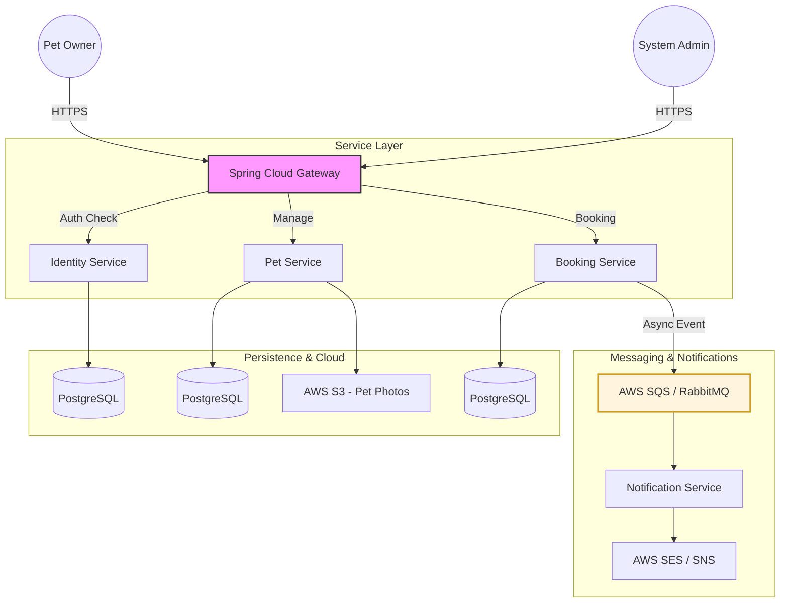

# 🐾 PawsStay Digital: Next-Gen Pet Boarding Ecosystem

Welcome to the **PawsStay Digital** engineering organization. We are building a cloud-native, microservices-based platform designed to streamline pet hotel operations and enhance the boarding experience for pet owners.

## 🏗 System Architecture (v2.0)

This project demonstrates a modern, event-driven microservices architecture optimized for scalability and reliability.

